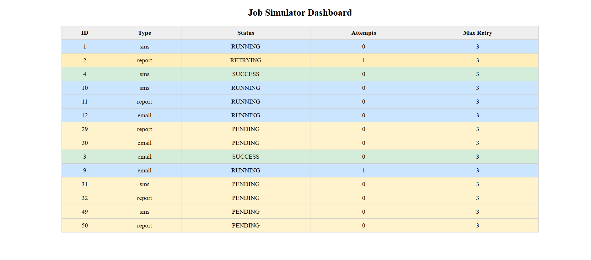
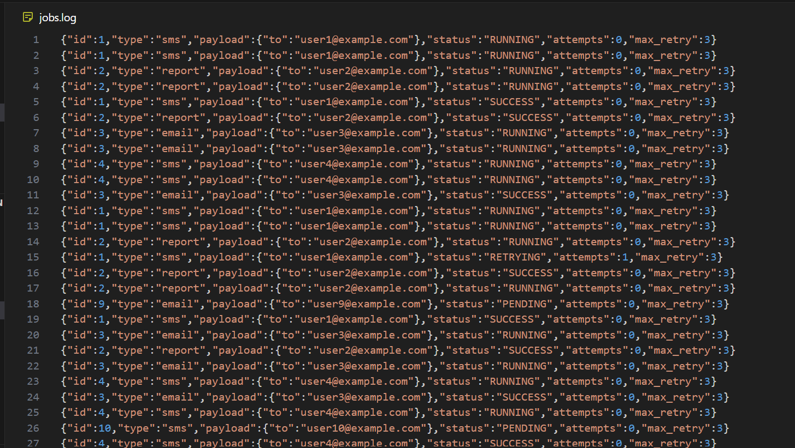

## Craxpert – Crash-Resilient Job Simulator


**Craxpert** is a robust, concurrent Job Queue Simulator built in **Go (Golang)**. It emphasizes crash recovery and write-ahead logging (WAL) to ensure jobs continue safely after unexpected shutdowns. It provides real-time observability through a beautiful enterprise web dashboard, a terminal monitor, and an HTTP API for job submission and tracking.

---

## Key Features

* **Concurrent Worker Pool**: Dispatch and process multiple simulated jobs (Emails, SMS, Reports, Webhooks) simultaneously using lightweight goroutines and channels.
* **Write-Ahead Log (WAL)**: All job state transitions (`PENDING`, `RUNNING`, `SUCCESS`, `FAILED`, `RETRYING`) are instantly serialized to disk before execution, ensuring zero data loss if the server crashes.
* **Checkpointing (Log Compaction)**: Employs a background "Steal/No-Force" compaction worker every 10 seconds to snapshot active jobs and flush them to disk, keeping the WAL tiny and optimized for millisecond startup times.
* **Enterprise SPA Dashboard**: A stunning, Stripe/Vercel-inspired UI built with pure HTML/CSS/JS. Features include:
  * **Job Queue**: Live-updating grid with dynamic row gradients.
  * **Activity Timeline**: A real-time audit log tracking all state transitions.
  * **Raw Logs View**: Direct access to the `jobs.log` WAL stream straight from the browser.
  * **Live Connection Monitor**: Auto-detects if the backend server goes offline or reboots.

---

## Architecture

* **Backend**: Go (`net/http`)
* **Concurrency**: Native Goroutines, Channels, `sync.RWMutex`
* **Persistence**: Append-only JSON WAL with periodic asynchronous compaction
* **Frontend**: Vanilla HTML5, CSS Variables, ES6 JavaScript Fetch API

### Project Structure

```text
go-job-simulator/
├── main.go           # Entry point: HTTP server, auto job generator, checkpointer
├── worker.go         # Worker pool logic, job execution, retry handling
├── job.go            # Job struct, job states, global job map, RWMutex
├── wal.go            # WAL persistence and checkpointing functions
├── utils.go          # Utility functions (random generator)
├── jobs.log          # WAL file (auto-created during runtime)
└── web/
    └── index.html    # Enterprise SPA Dashboard
```

---

## Getting Started

### Prerequisites
* Go 1.20+ installed and added to your system `PATH`.

### Initialization & Running
1. Clone the repository and initialize the module (if needed):
   ```bash
   git clone https://github.com/sujith0613/Craxpert.git
   cd Craxpert
   go mod init go-job-simulator-clean
   ```
2. Start the backend server:
   ```bash
   go run .
   ```
3. Open the Operations Dashboard in your browser:
   ```text
   http://localhost:8080
   ```

### HTTP API - Submit a Job manually

`POST /jobs`  
Content-Type: `application/json`

```bash
curl -X POST http://localhost:8080/jobs \
-H "Content-Type: application/json" \
-d '{"id":102,"type":"report","payload":{"to":"admin"},"max_retry":3}'
```

---

## Dashboard Controls

* **Reset System**: Completely drops all jobs from memory, deletes the WAL history, and resets the simulator to zero instantly.
* **Stop/Start Auto-Gen**: Pauses the random job generator so you can observe the queue drain or manually test single injections.
* **Terminal Monitor**: A console-based table that refreshes every 1.5 seconds, allowing you to observe concurrency directly in your terminal.

---

## Recent Bug Fixes & Optimizations
* Solved `5 / 0` Attempt Glitches by perfectly reconstructing the *latest* state of a job during WAL bootup and defaulting missing `MaxRetry` keys.
* Prevented memory-crash panics (`concurrent map read and write`) by implementing strict `sync.RWMutex` locking across HTTP Handlers, Workers, and the Reset controllers.
* Fixed server deadlocks caused by unbuffered channel blocks during massive WAL restores by making worker submissions entirely asynchronous.

---

## Demo

**Web Dashboard**  


**Log File Output**  


---

## Use Cases

* Demonstrates Go concurrency patterns (goroutines, channels).
* Backend system simulation for portfolios or interviews.
* Learning worker pools, retries, and job state management.
* Observability via terminal and web dashboard.
* Database-less WAL-based persistence for fault tolerance.

## Notes

* Jobs are created both automatically by the Go program and manually via HTTP API.
* The web dashboard is a live read-only viewer powered by short-polling `/jobs/status`.
* WAL (`jobs.log`) ensures recovery after crashes or shutdown, while `jobs.tmp` acts as a staging file for memory snapshotting.

## License

MIT License
